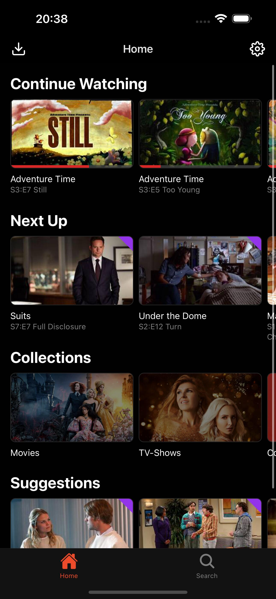
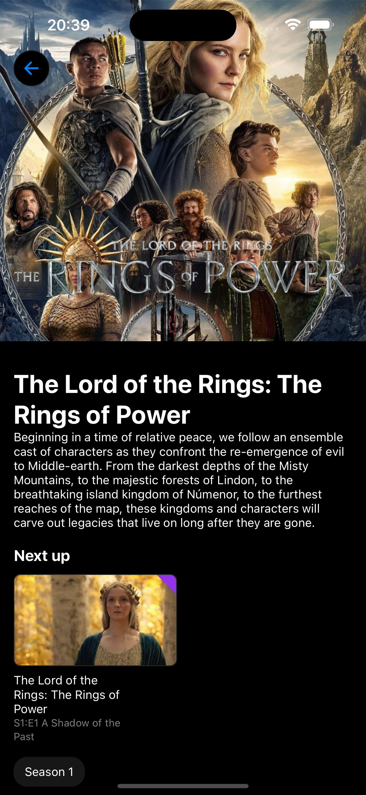
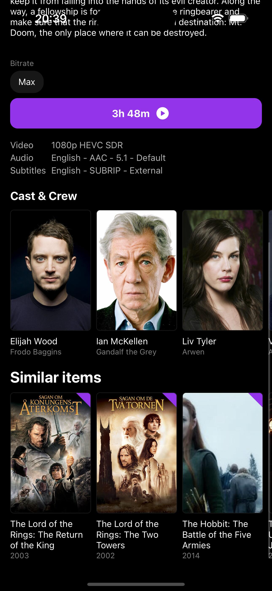
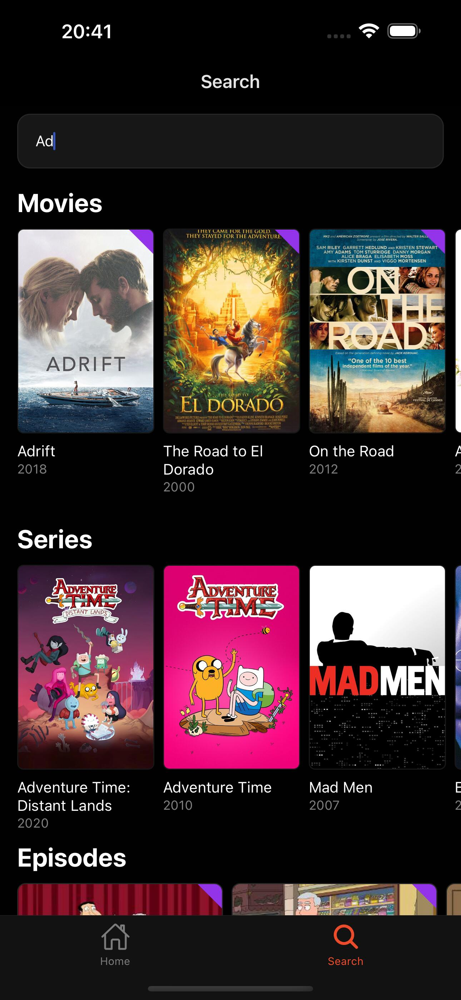

# 📺 Streamyfin

Welcome to Streamyfin, a simple and user-friendly Jellyfin client built with Expo. If you're looking for an alternative to other Jellyfin clients, we hope you'll find Streamyfin to be a useful addition to your media streaming toolbox.

<div style="display: flex; flex-direction: row; gap: 5px">
  
  
  
  
  
</div>

## 🌟 Features

- 🔗 Connect to your Jellyfin instance: Easily link your Jellyfin server and access your media library.
- 📱 Native video player: Playback with the platform native video player. With support for subtitles, playback speed control, and more.
- 📥 Download media (Experimental): Save your media locally and watch it offline.
- 📡 Chromecast media (Experimental): Cast your media to any Chromecast-enabled device.

## 🧪 Experimental Features

Streamyfin includes some exciting experimental features like media downloading and Chromecast support. These are still in development, and we appreciate your patience and feedback as we work to improve them.

## 🛠️ TestFlight

As of right now only iOS users can test Streamyfin in beta via TestFlight. To join the beta program, click the link below.

<a href="https://testflight.apple.com/join/CWBaAAK2">
  
</a>

## 🚀 Getting Started

### Prerequisites

- Ensure you have an active Jellyfin server.
- Make sure your device is connected to the same network as your Jellyfin server.

### Installation

Clone the repository:

```bash
git clone https://github.com/your-username/streamyfin.git
```

Navigate to the project directory:

```bash
cd streamyfin
```

Install the dependencies:

```bash
npm install
```

Run the app:

```bash
expo start
```

## 🙌 Contributing

We welcome any help to make Streamyfin better. If you'd like to contribute, please fork the repository and submit a pull request. For major changes, it's best to open an issue first to discuss your ideas.

## 📄 License

Streamyfin is licensed under the [GNU General Public License v3.0 (GPL-3.0)](https://www.gnu.org/licenses/gpl-3.0.en.html).

This means you are free to use, modify, and distribute this software. However, any modifications or larger works must also be released under the GPL-3.0. This license ensures that all versions of the software remain free and open source.

Key points of the GPL-3.0:

- You can use the software for any purpose
- You can modify the software and distribute modified versions
- You must include the original copyright and license notices
- You must disclose your source code when you distribute the software
- Any modifications or larger works must also be licensed under GPL-3.0

For the full text of the license, please see the [LICENSE](LICENSE.txt) file in this repository.

## 🌐 Connect with Us

If you have questions or need support, feel free to reach out:

- GitHub Issues: Report bugs or request features here.
- Email: [fredrik.burmester@gmail.com](mailto:fredrik.burmester@gmail.com)
