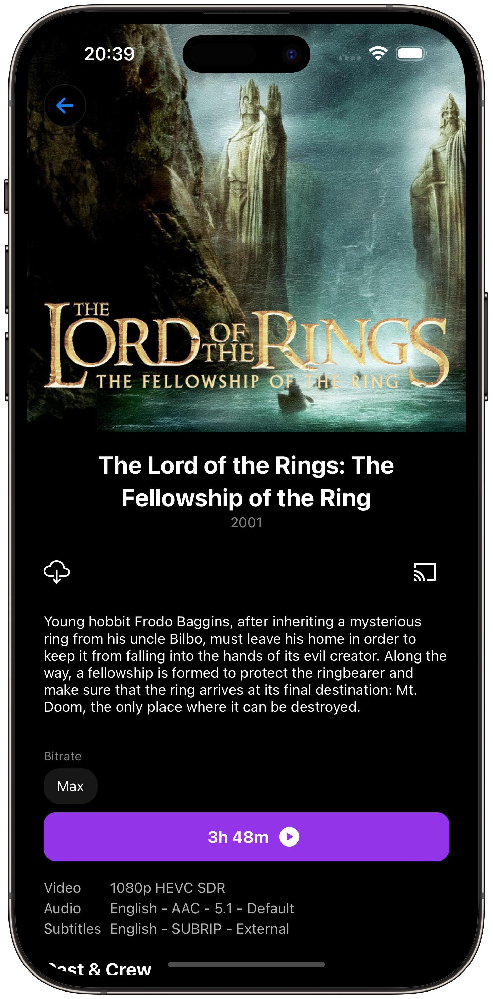
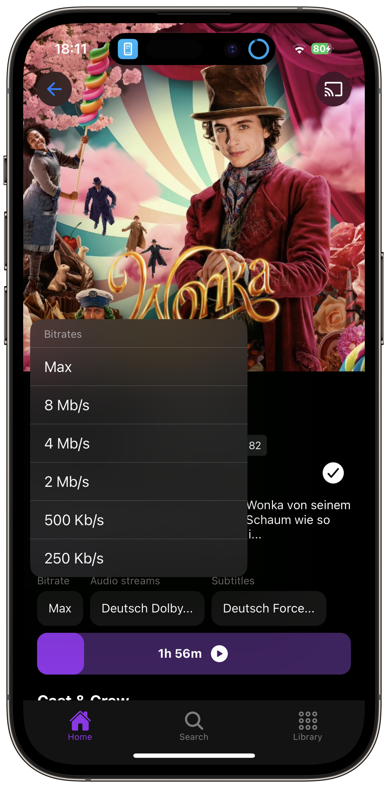
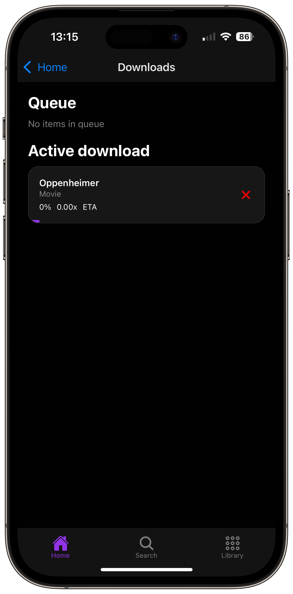

# 📺 Streamyfin

Welcome to Streamyfin, a simple and user-friendly Jellyfin client built with Expo. If you're looking for an alternative to other Jellyfin clients, we hope you'll find Streamyfin to be a useful addition to your media streaming toolbox.

  
  
  
  

## 🌟 Features

- 🚀 **Skp intro / credits support**
- 🖼️ **Trickplay images**: The new golden standard for chapter previews when seeking.
- 🔊 **Background audio**: Stream music in the background, even when locking the phone.
- 📥 **Download media** (Experimental): Save your media locally and watch it offline.
- 📡 **Chromecast** (Experimental): Cast your media to any Chromecast-enabled device.
- 🤖 **Jellyseerr integration**: Request media directly in the app.

## 🧪 Experimental Features

Streamyfin includes some exciting experimental features like media downloading and Chromecast support. These are still in development, and we appreciate your patience and feedback as we work to improve them.

### Downloading

Downloading works by using ffmpeg to convert an HLS stream into a video file on the device. This means that you can download and view any file you can stream! The file is converted by Jellyfin on the server in real time as it is downloaded. This means a **bit longer download times** but supports any file that your server can transcode.

### Chromecast

Chromecast support is still in development, and we're working on improving it. Currently, it supports casting videos and audio, but we're working on adding support for subtitles and other features.

## Plugins

In Streamyfin we have built-in support for a few plugins. These plugins are not required to use Streamyfin, but they add some extra functionality.

### Collection rows

Jellyfin collections can be shown as rows or carousel on the home screen.
The following tags can be added to a collection to provide this functionality.

Available tags:

- sf_promoted: will make the collection a row at home
- sf_carousel: will make the collection a carousel on home.

A plugin exists to create collections based on external sources like mdblist. This make the automatic process of managing collections such as trending, most watched, etc.
See [Collection Import Plugin](https://github.com/lostb1t/jellyfin-plugin-collection-import) for more info.

### Jellysearch

[Jellysearch](https://gitlab.com/DomiStyle/jellysearch) now works with Streamyfin! 🚀

> A fast full-text search proxy for Jellyfin. Integrates seamlessly with most Jellyfin clients.

## Roadmap for V1

Check out our [Roadmap](https://github.com/users/fredrikburmester/projects/5) to see what we're working on next. We are always open for feedback and suggestions, so please let us know if you have any ideas or feature requests.

## Get it now

  
  

Or download the APKs [here on GitHub](https://github.com/streamyfin/streamyfin/releases) for Android.

### Beta testing

To access the Streamyfin beta, you need to subscribe to the Member tier (or higher) on [Patreon](https://www.patreon.com/streamyfin). This will give you immediate access to the ⁠🧪-public-beta channel on Discord and i'll know that you have subscribed. This is where i'll post APKs and IPAs. This won't give automatic access to the TestFlight however, so you need to send me a DM with the email you use for Apple so that i can manually add you.

 **Note**: Everyone who is actively contributing to the source code of Streamyfin will have automatic access to the betas.

## 🚀 Getting Started

### Prerequisites

- Ensure you have an active Jellyfin server.
- Make sure your device is connected to the same network as your Jellyfin server.

## 🙌 Contributing

We welcome any help to make Streamyfin better. If you'd like to contribute, please fork the repository and submit a pull request. For major changes, it's best to open an issue first to discuss your ideas.

### Development info

1. Use node `>20`
2. Install dependencies `bun i && bun run submodule-reload`
3. Make sure you have xcode and/or android studio installed.
4. Create an expo dev build by running `npx expo run:ios` or `npx expo run:android`. This will open a simulator on you computer and run the app.

## 📄 License

Streamyfin is licensed under the Mozilla Public License 2.0 (MPL-2.0).
This means you are free to use, modify, and distribute this software. The MPL-2.0 is a copyleft license that allows for more flexibility in combining the software with proprietary code.
Key points of the MPL-2.0:

- You can use the software for any purpose
- You can modify the software and distribute modified versions
- You must include the original copyright and license notices
- You must disclose your source code for any modifications to the covered files
- Larger works may combine MPL code with code under other licenses
- MPL-licensed components must remain under the MPL, but the larger work can be under a different license
- For the full text of the license, please see the LICENSE file in this repository.

## 🌐 Connect with Us

Join our Discord: [https://discord.gg/aJvAYeycyY](https://discord.gg/aJvAYeycyY)

If you have questions or need support, feel free to reach out:

- GitHub Issues: Report bugs or request features here.
- Email: [fredrik.burmester@gmail.com](mailto:fredrik.burmester@gmail.com)

## 📝 Credits

Streamyfin is developed by [Fredrik Burmester](https://github.com/fredrikburmester) and is not affiliated with Jellyfin. The app is built with Expo, React Native, and other open-source libraries.

## ✨ Acknowledgements

I'd like to thank the following people and projects for their contributions to Streamyfin:

- [Reiverr](https://github.com/aleksilassila/reiverr) for great help with understanding the Jellyfin API.
- [Jellyfin TS SDK](https://github.com/jellyfin/jellyfin-sdk-typescript) for the TypeScript SDK.
- [Jellyseerr](https://github.com/Fallenbagel/jellyseerr) for enabling API integration with their project.
- The Jellyfin devs for always being helpful in the Discord.

## Star History

